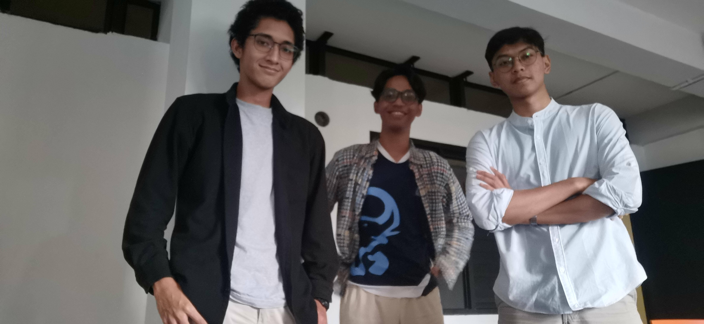

# Algeo02-22136
| NIM | Nama |
| :---: | :---: |
| 13522150 | Albert Ghazaly |
| 13522136 | Muhammad Zaki |
| 13522149 | Muhammad Dzaki Arta |

## Foto


## Deskripsi Program
 - Program ini dapat mencari similarity image dengan metode CBIR Texture
 - Program ini dapat mencari similarity image dengan metode CBIR Colour
 - Program ini dapat mencari similarity image dengan input dari kamera
 - Program ini dapat mencari similarity image dengan input dari file
   
## How to Use
1. Make sure to already have all libraries needed,  

    or you can checkout this link ! https://blog.miguelgrinberg.com/post/how-to-create-a-react--flask-project
2. Go to src/web-app/src

    ```bash
    cd ../src/web-app/src
    ```
<br>

3. Activate the virtual environment (optional):

    ```bash
    # Navigate to the API folder
    cd ../api

    # Create a virtual environment (if not already created)
    python -m venv venv

    # Activate the virtual environment
    source venv/bin/activate  # On macOS/Linux
    .\venv\Scripts\activate    # On Windows
    ```

4. Install Python dependencies:

    ```bash
    pip install -r requirements.txt
    ```
5. start localhost server to open the website

    ```bash
    npm install 
    npm install --global yarn
     ```
   
6. back to folder web-app and open two terminal<br>

    
    a. Terminal 1:
    ```bash
     yarn start
    ``````
    b. Terminal 2: 
    ```bash
    yarn start-api
      ```

